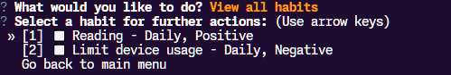

# Habit Tracker App

The habit tracker is a command-line application created with Python. It allows the tracking and analysis of created habits over a period of time.

---

## Features

- Personalized habit creation
- Edit, Archive, and Delete habits
- Checking off habits and tracking them
- Streak logic for user motivation
- Habit type and period filtering
- Multiple ways of habit analysis

---

## Installation

The app can be installed through GitHub. 

To clone the repository and install all dependencies:

```bash
git clone 
cd habit_components
pip install -r requirements.txt
```

## Usage

_Note: Make sure you have Python 3.7+ installed._

To start the command-line interface of the app, run the following in the terminal.

```bash
python cli.py
```

### Choice Selection


The user can use the arrow keys to navigate between choices and then press the Enter key.

### Creating Habits

Once the user selects "Create a new habit" from the menu, they will be prompted to enter the name, period, and type of the habit.


### Viewing Habits and Further Actions

Once the user selects "View all habits", a list of active habits will be displayed. The user can then select one of them to perform actions. 



The user selects the first habit and can perform further actions upon it, such as marking it completed:


The user is back to viewing and selecting habits:


## Testing

Individual test files can be found in the following directory:

habit_tracker/tests/

All tests can be checked at once using:

```bash
pytest
```

To run individual test files:

```bash
pytest tests/test_....py
```

## Contributing

Contributions to this project are welcome and appreciated. Please feel free to submit issues, suggest enhancements, or open a pull request for review.

## License

This project is licensed under the [MIT License](LICENSE.txt).